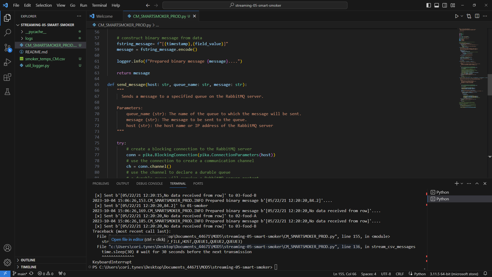

# streaming-05-smart-smoker
CORI MILLER MOD 5 Creating a Producer

## Project Overview

The Problem / Challenge To Solve
We want to stream information from a smart smoker. Read one value every half minute. (sleep_secs = 30)

smoker-temps.csv has 4 columns:

[0] Time = Date-time stamp for the sensor reading
[1] Channel1 = Smoker Temp --> send to message queue "01-smoker"
[2] Channel2 = Food A Temp --> send to message queue "02-food-A"
[3] Channel3 = Food B Temp --> send to message queue "03-food-B"
Requirements

RabbitMQ server running
pika installed in your active environment

## Screenshots
